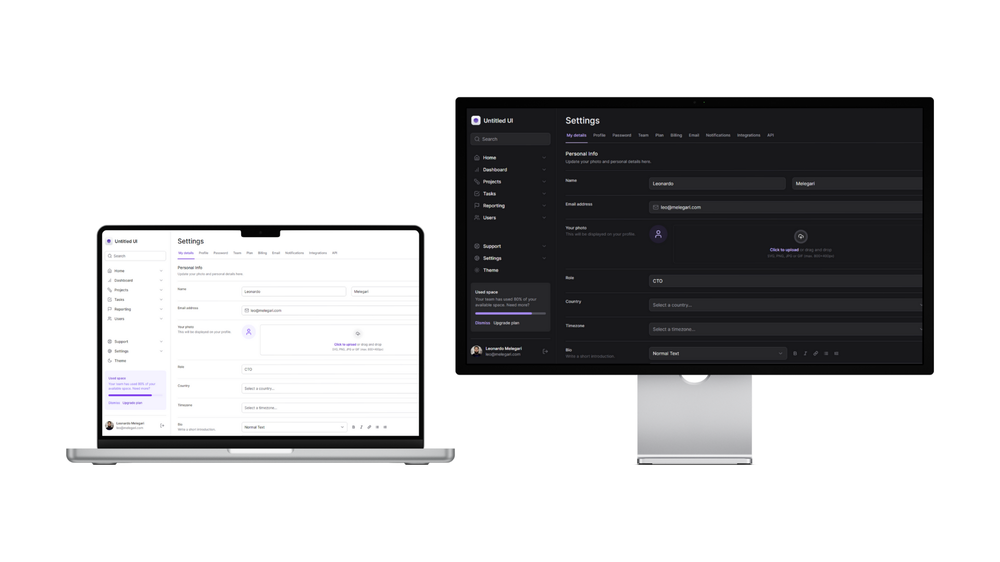
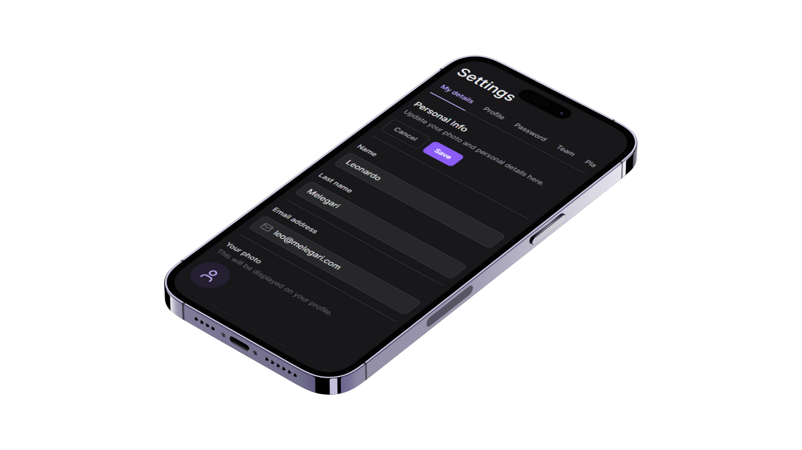

<strong style="text-align: center; display: block; font-size: 50px">Masterizando o Tailwind</strong>

  <a href="#-tecnologias">Tecnologias</a>&nbsp;&nbsp;&nbsp;|&nbsp;&nbsp;&nbsp;
  <a href="#-features">Features</a>&nbsp;&nbsp;&nbsp;|&nbsp;&nbsp;&nbsp;
  <a href="#-executando-o-projeto">Executando o projeto</a>&nbsp;&nbsp;&nbsp;|&nbsp;&nbsp;&nbsp;

 

  <a href="https://masterizando-tailwind-eta.vercel.app/" target="_blank">Clique aqui</a> para acessar a versão web

## 🖥️ Projeto

Projeto realizado como base de estudos do framework Tailwind CSS junto com Reactjs e Nextjs. Por ser mais voltado a prática do Tailwind, o projeto não conta com funcionalidades mais avançadas como: login, cadastro de contas, dentre outras...

## 📲 Tecnologias

Esse projeto foi desenvolvido com as seguintes tecnologias/bibliotecas:

<table border="0">
 <tr>
<td> JavaScript</td>
<td> React.JS</td>
<td> Next.js</td>
<td> Typescript</td>
 </tr>
 <tr>
<td> Tailwind CSS</td>
<td> Radix UI</td>
<td> Framer Motion</td>
<td> Lucide Icons</td>

 </tr>
</table>

## 🌟 Features

-   [x] Responsividade;
-   [x] Dark Mode;
-   [x] Upload de arquivos (não funcional);

## 👨🏻‍💻 Executando o projeto

- 1º - clone o repositório para seu computador;
- 2º - no local clonado, abra o terminal e execute **npm install** para instalar as dependências do projeto;
- 3º - abra o projeto com o comando **code . **.

## 💻 Acessando a versão web

Para acessar a versão web basta executar o comando **npm run dev** e abrir seu navegador em http://localhost:3000/
